# TRELLIS v2: concepts and chunks in two hierarchies

TRELLIS v2 learns how experiences are built from parts. Every element of an experience is both a **concept** (a category of things that behave alike) and a **chunk** (a whole made of parts). The learner keeps the two aspects in two Cobweb hierarchies: the **representation hierarchy** (concepts: how elements behave) and the **composition hierarchy** (chunks: what elements are made of). These two hierarchies are the core of v2. The grammar's categories and chunk types are cuts through them, and that one probabilistic grammar parses, generates, and measures how many bits the experiences cost to describe. Description length decides everything that a threshold decided in TRELLIS v1: which concepts serve as categories, which chunks exist, and which analysis of a sentence is right. The learner works from analysed sentences or from sentences alone, and learns incrementally, perceiving by day and consolidating by night.

This document explains the whole framework: what is stored, how the grammar is formed, how it is used, how it is learned without supervision, and how well it works. [`V2_DESIGN.md`](V2_DESIGN.md) keeps the design decisions, the evidence behind each representational choice and the detailed result tables. Every figure is drawn from trained models, by [`figures/make_figures.py`](figures/make_figures.py) or by the experiment scripts in `experiments/v2`.

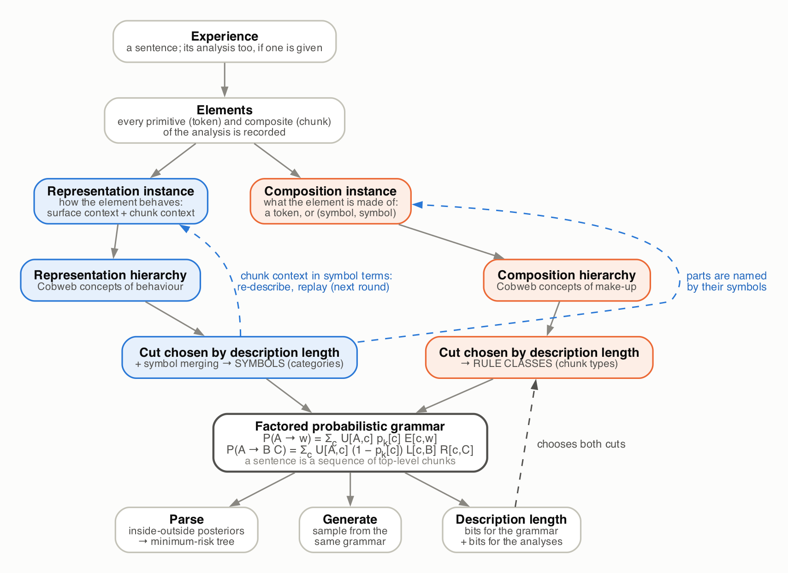

*Figure 1. The framework at a glance. Each element of an experience is described twice: by how it behaves (blue) and by what it is made of (orange). Cobweb organizes each kind of description into a hierarchy of concepts. A cut through each hierarchy, chosen by description length, gives the grammar's categories (symbols) and chunk types (rule classes). One factored grammar then parses, generates and prices the data.*

## Contents

1. [Ideas](#1-ideas)
2. [A running example](#2-a-running-example)
3. [Elements and their two descriptions](#3-elements-and-their-two-descriptions)
4. [The two hierarchies](#4-the-two-hierarchies)
5. [From hierarchies to a grammar](#5-from-hierarchies-to-a-grammar)
6. [Description length](#6-description-length)
7. [Parsing and generation](#7-parsing-and-generation)
8. [Learning from sentences alone, by day and by night](#8-learning-from-sentences-alone-by-day-and-by-night)
9. [Evaluation](#9-evaluation)
10. [Results](#10-results)
11. [Beyond the synthetic grammars](#11-beyond-the-synthetic-grammars)
12. [Relation to TRELLIS v1 and the paper's postulates](#12-relation-to-trellis-v1-and-the-papers-postulates)
13. [Using the code](#13-using-the-code)
14. [Limitations and next steps](#14-limitations-and-next-steps)
15. [Glossary](#15-glossary)
16. [References](#16-references)

## 1. Ideas

- **Concepts and chunks are two aspects of one representation.** "the dog" is a chunk, made of *the* and *dog*. It is also an instance of a concept, the things that can be the subject of *saw*. TRELLIS v2 records both aspects of every element and lets each organize its own hierarchy.
- **Two hierarchies, each holding primitives and composites.** The *representation hierarchy* groups elements by behaviour. The *composition hierarchy* groups them by make-up. Single words and multi-word chunks live in the same trees. There are no separate trees for words, phrases or non-constituents. Both are load-bearing. Read straight off the unsupervised search's analyses, the grammar's generations break the target grammar 47–56% of the time on the TERM corpora; once the same analyses are consolidated into the two hierarchies and re-analysed, 0.1–4.3% ([section 10](#learning-from-sentences-alone)).
- **The grammar is a cut through each hierarchy.** A cut is a set of concepts that partitions the elements. The cut through the representation hierarchy gives the categories (symbols); the cut through the composition hierarchy gives the chunk types (rule classes).
- **One model for parsing, generation and learning.** The grammar is a normalized probabilistic grammar. The parser computes posteriors under it, generation samples from it, and its code lengths decide the cuts. There are no separate pools, filters or fallbacks.
- **Description length replaces thresholds.** A category, a chunk type or a structure exists only if it shortens the description of the data, including the description of the grammar itself. "Minimize chunks while preserving performance" is the learning objective, not a heuristic.
- **Learning alternates day and night.** By day each experience is perceived with the current grammar and stored. By night the stored experiences are consolidated: a search for shorter analyses, then a replay into the two hierarchies.

## 2. A running example

The paper's SMALL corpus is generated by a tiny grammar: `S → NP VP`, `VP → V NP`, `NP → Det N`, with 13 words. A training experience is a sentence such as *a man saw a cat*. In the supervised regime it comes with its analysis, the binary tree `[[a man] [saw [a cat]]]`; in the unsupervised regime it comes alone. The larger corpora (MED, LARGE and three MED variants with 11-, 22- and 39-word lexicons; [section 9](#9-evaluation)) add adjective phrases, prepositional phrases and relative clauses.

The learner never sees category names. The symbols it forms are numbered S1, S2, …; the figures add the gold name a symbol mostly corresponds to (for example *S1 ≈ NP*) for orientation only.

## 3. Elements and their two descriptions

An **element** is a node of an analysis: a *primitive* (a single token) or a *composite* (a chunk made of two parts). Learning an analysed sentence records every element, bottom up. Each element is then described in two ways.

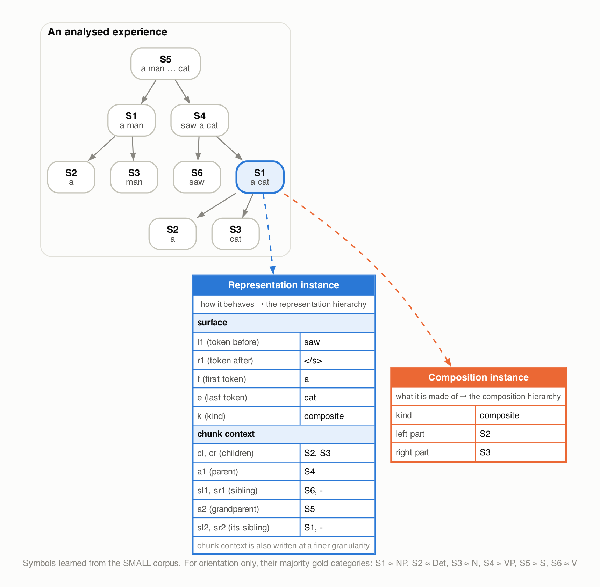

*Figure 2. The object noun phrase "a cat" (highlighted) of an analysed SMALL sentence, and its two descriptions. The representation instance says how the element behaves; the composition instance says what it is made of. Symbol names come from the grammar learned on the SMALL corpus.*

**The representation instance** (how the element behaves) has two parts:

| Attribute | Meaning |
|---|---|
| `l1`, `r1` | the token before and after the element |
| `f`, `e` | its first and last token |
| `k` | its kind: primitive or composite. A head and its phrase (*dog* / *the dog*) share right context and last word; the kind keeps them apart |
| `cl`, `cr` | the categories of its two children |
| `a1`, `sl1`, `sr1` | its parent's category, and the category of the sibling beside it |
| `a2`, `sl2`, `sr2` | the same one level up (grandparent and the parent's sibling) |

The second group is the **chunk context**: it places the element inside the analysis in category terms. The two-level spine is what separates a verb from a preposition: both sit between a noun and a determiner, and only the analysis around them (the chunk they head and its neighbours) tells them apart. Chunk context is written twice, once with the grammar's symbols and once with a finer node of the hierarchy, so that categories merged in one round do not erase distinctions the next round needs. The top-level chunks of a partial analysis (a forest) use their neighbouring top-level chunks as siblings.

**The composition instance** (what the element is made of) is the token of a primitive, or the pair of child symbols of a composite.

The surface part of the representation instance belongs to the domain. A sentence element's context window is the token on either side. A chess piece's context window is a star: the first piece along each of the eight queen rays, at any distance, and the piece on each knight square ([section 11](#parts-joined-by-typed-relations-chess)). Where parts are joined by more than one relation, as on a board, the composition instance also records the relation.

## 4. The two hierarchies

Both hierarchies are built by **Cobweb** (Fisher 1987), compiled: `cobweb_cu` from cobweb-private reproduces the pure-Python reference implementation exactly, random tie-breaking included, 10–20 times faster. Cobweb sorts each instance down a tree of probabilistic concepts. At each level it chooses the operation (join the best child, create a new child, merge two children, split one) that maximizes *category utility*: how much better the children predict attribute values than their parent does. Cobweb is incremental: a new instance updates the counts along one path. Leaves are stable handles, and identical instances share a leaf. Instances carry weights, and attributes may be bags of values.

- The **representation hierarchy** is built over representation instances. Its concepts group elements that behave alike.
- The **composition hierarchy** is built over composition instances, written in symbol terms. Its concepts group compositions that are made alike.

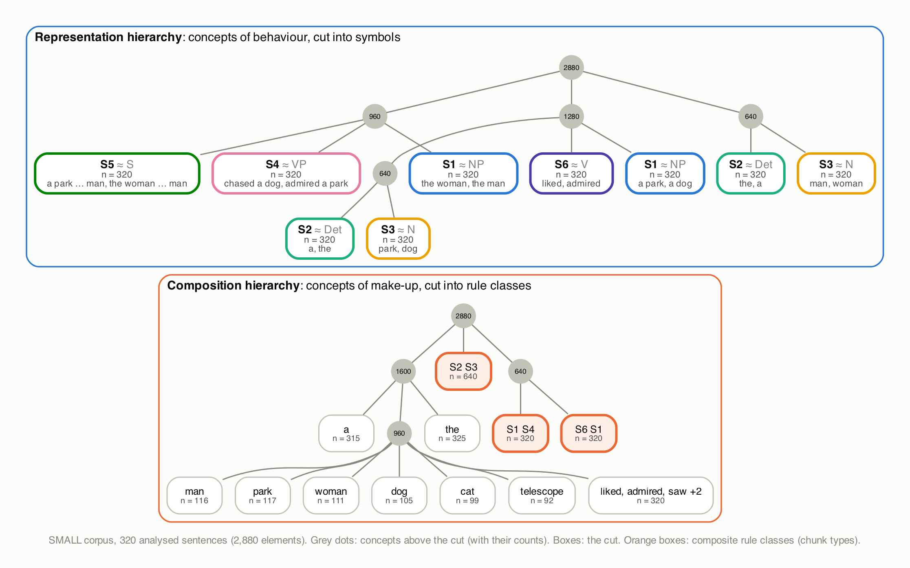

*Figure 3. The two hierarchies learned from the SMALL corpus, drawn down to their cuts. Grey dots are concepts above the cut, with counts. Boxes are the concepts on the cut. Top: the representation hierarchy separates subject and object noun phrases (two S1 boxes), together with their determiners and nouns. Description length then merges them into one symbol each, because the two positions use the same words in the same way. Bottom: the composition hierarchy's cut gives one rule class per determiner and noun, one for all verbs, and three composite rule classes: the chunk types Det N, NP VP and V NP.*

**Consolidation rounds.** Chunk context needs categories, and categories come from the hierarchy. Consolidation therefore iterates:

1. Describe every recorded element with the previous round's categories (blank chunk context in the first round, or the categories of a given analysis).
2. Rebuild the representation hierarchy by replaying the elements in learning order.
3. Choose the cuts and read off the grammar.
4. Repeat until the partition into symbols is stable (at most six rounds), and keep the round with the shortest code.

## 5. From hierarchies to a grammar

The representation cut gives **K symbols** (categories) A, B, C, …; the composition cut gives **M rule classes** c. The grammar is a factored probabilistic context-free grammar:

$$P(A \to w) = \sum_c U[A,c]\; p_k[c]\; E[c,w]$$

$$P(A \to B\,C) = \sum_c U[A,c]\; (1 - p_k[c])\; L[c,B]\; R[c,C]$$

| Table | Meaning |
|---|---|
| `U[A, c]` | how symbol A is realized: the probability of rule class c |
| `p_k[c]` | whether rule class c makes a primitive (a token) or a composite |
| `E[c, w]` | which token a primitive rule class emits |
| `L[c, B]`, `R[c, C]` | which symbols fill the left and right parts of a composite rule class |
| `S[A]`, stop | the category of each top-level chunk, and whether another one follows |
| `Rel[c, r]` | in a domain with typed relations (chess), which relation joins the two parts |

A sentence is a sequence of top-level chunks, so a partial analysis (a forest) is a proper derivation: graceful failure in the sense of the paper and GRIDS-style partial parses. A fully parsed sentence is a single top-level chunk.

Rule classes share their child distributions. That is where the grammar generalizes: a rule class that has seen *Det N* and *Det AdjP* lets every determiner combine with every noun phrase body.

Every table is the posterior predictive of a Dirichlet-multinomial with a sparse concentration, α = 0.001: (count + α) / (total + α × alphabet size). The model is normalized by construction, so a grammar that over-generates pays for it in code length.

## 6. Description length

The learner measures a grammar by the bits needed to transmit the training data with it:

- **The code.** Each derivation is sent event by event, every event coded with the Dirichlet-multinomial predictive of its table. This is the Bayesian mixture code that arithmetic coding achieves: a prequential code that does not depend on presentation order. The grammar's size (K and M) is sent with Elias codes, so the total is an actual message length.
- **Model and data bits.** *Data bits* are the cost of the derivations under the best-fitting parameters. *Model bits* are the rest: the price of learning the parameters, which grows with the number of categories and chunk types.

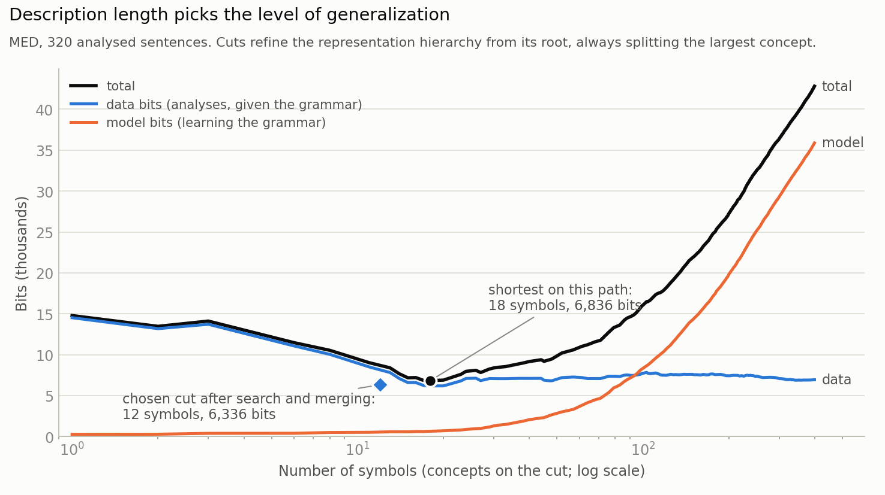

*Figure 4. Cuts through the MED representation hierarchy, from the root (one symbol) to fine cuts (hundreds). Coarse cuts are cheap to learn but describe the data badly; fine cuts describe the data well but cost many model bits. The total has a minimum. The search over cuts plus symbol merging (diamond) finds a shorter code than any cut on this simple refinement path.*

**Choosing the symbols.** The search over cuts of the representation hierarchy starts from two cuts: the evidence-optimal cut, found by a bottom-up dynamic program, and a fine cut. It hill-climbs from each with two moves: *refine* (replace a concept by its children) and *collapse* (replace concepts by their common ancestor). It keeps the shorter code. **Bayesian model merging** (Stolcke & Omohundro 1994) then joins any two symbols, siblings or not, while the code shrinks. Merging is how subject and object noun phrases became one symbol in Figure 3.

**Choosing the rule classes.** The composition hierarchy is rebuilt over the attested compositions in symbol terms. Its cut is searched the same way, under the code of the full factored grammar.

## 7. Parsing and generation

**Parsing** is inside-outside over the factored grammar (Baker 1979; Lari & Young 1990):

- The **inside pass** computes, for every span and category, the probability of the span's content. Per-span scaling keeps long sentences from underflowing, and the factorization keeps each span at O(n·M).
- A **top-level forward–backward pass** sums over the ways of cutting the sentence into top-level chunks.
- The **outside pass** gives μ(i, j, A): the probability that the span from i to j is a chunk of category A, given everything in the sentence, both content and context. These posteriors are the chunks' strength; they replace v1's recognition threshold.
- **Decoders.** The *minimum-risk tree* maximizes the expected number of correct spans (Goodman 1996); it is the parser's output. The *Viterbi analysis* is the most probable derivation, which is the analysis with the shortest code; perception and unsupervised learning use it. *Posterior sampling* draws analyses in proportion to their probability. Spans with posterior above 0.5 never cross, so they can be learned as confirmed chunks.

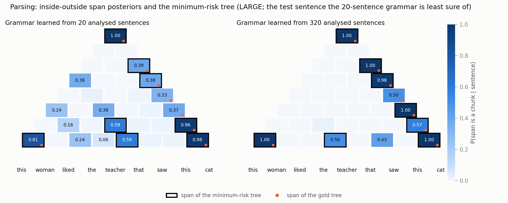

*Figure 5. The span posteriors for one held-out LARGE sentence, drawn as a parsing chart: each cell is a span, words at the bottom, the whole sentence at the top. The sentence is the one the grammar learned from 20 sentences is least sure about: it spreads probability over several analyses of the relative clause. With 320 sentences most spans are certain, and the minimum-risk tree (black outlines) agrees with the gold tree (orange dots) on most spans.*

**Generation** samples from the same grammar: draw the category of a top-level chunk from S, expand it top-down through U, p<sub>k</sub>, E, L and R, and continue with another top-level chunk or stop. Generation can be tempered to explore more or less freely. Twelve sentences sampled from the grammar learned from 320 MED *sentences alone* (seed 13) were all novel, and the target grammar accepted all twelve. Eight of them:

```
[[[the cat] chased] [the cat]]
[[[[a telescope] found] [a man]] [with [the park]]]
[[[the park] liked] [[[a lazy] lazy] man]]
[[[[[the small] quick] telescope] liked] [the dog]]
[[[[the cat] found] [[[[the lazy] quick] quick] cat]] [under [[[a quick] red] telescope]]]
[[[[the woman] admired] [a man]] [under [the dog]]]
[[[[a dog] chased] [[[the red] quick] man]] [with [the man]]]
[[[the telescope] liked] [a woman]]
```

The brackets are the learner's own: it chunks a subject with its verb before adding the object, where linguists attach the object to the verb ([section 8](#what-the-search-finds)).

## 8. Learning from sentences alone, by day and by night

Without analyses the learner must find the structure itself. It looks for the analyses and the grammar that transmit the corpus in the fewest bits ([section 6](#6-description-length)), so a chunk type forms only if it pays for its definition.

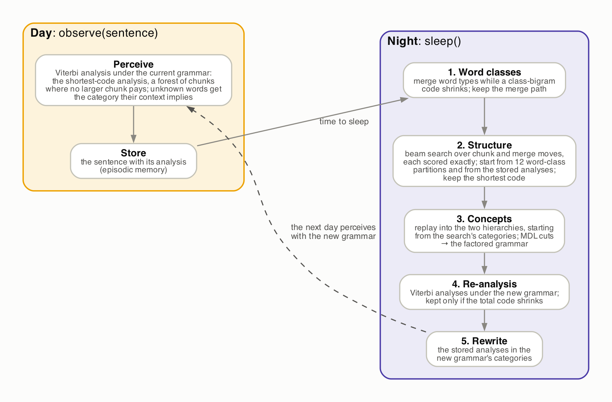

*Figure 6. Learning by day and by night. Sleeping once after observing everything is batch learning.*

**By day** (`observe`), each sentence is perceived with the current grammar: its Viterbi analysis, which is also its shortest-code analysis. Where no larger chunk pays, the analysis is a forest of chunks, and unknown words get the category their context implies. The sentence is stored with its analysis. Before the first night there is no grammar, and sentences are stored as they come.

**By night** (`sleep`), all stored sentences are consolidated in six steps.

1. **Word classes.** Word types are merged while the code of a class-bigram model shrinks: Brown clustering (Brown et al. 1992) read as description length. The whole merge path, from word types to the final classes, is kept.
2. **Structure.** A search over two moves lowers the plain-PCFG code of the corpus:
   - *chunk* (B, C) replaces every adjacent pair of top-level categories B C by a new chunk;
   - *merge* (A, A′) makes two categories one.

   Every move is global: it changes all sentences consistently, which is what lets a chunk type pay for itself. This is SNPR (Wolff 1982), GRIDS (Langley & Stromsten 2000) and Bayesian model merging under one probabilistic code.
3. **Concepts.** The analyses are consolidated into the two hierarchies ([sections 4–6](#4-the-two-hierarchies)). Consolidation starts from the search's categories, which describe the chunk context of the first round.
4. **Re-analysis.** Every sentence gets its Viterbi analysis under the new grammar, and the new analyses are kept only if the total code shrinks (hard EM).
5. **Choice.** Steps 3 and 4 run on each of the three best distinct search results, and the grammar with the shortest total code wins. The plain code is cheap enough to guide the search, but the full code makes the final choice: two analyses whose plain codes differ by a bit can consolidate into very different grammars.
6. **Rewrite.** The stored analyses are written in the new grammar's categories, for the next day to perceive with and the next night to start from.

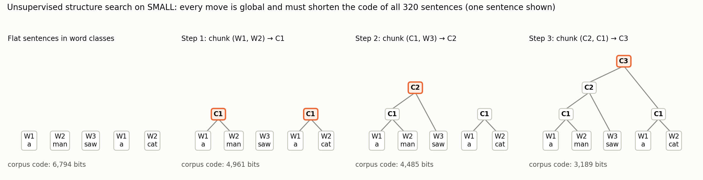

*Figure 7. The structure search on SMALL, from flat sentences in three word classes to a grammar in three moves. Each move must shorten the code of all 320 sentences; the corpus code falls from 6,794 to 3,189 bits, the code of the gold grammar. The search chunks the subject with its verb (C2) before adding the object, a different binarization of the same language.*

### The search

- **Exact scores, incremental moves.** The code is a sum of Dirichlet-multinomial row terms. A move changes only a few rows, plus the alphabet size that every row's normalizer depends on, so every candidate move is scored exactly from cached row sums, without rebuilding the analyses. The scores agree with a full recomputation to 10⁻¹² bits. Applying a move is incremental too: a chunk move rewrites only the sentences that contain the pair, and a merge only records a renaming. Word classes are scored the same way: each merge of two classes changes two rows and two columns of the class-bigram counts.
- **Beam.** Each step keeps the four best distinct successors, even ones longer than their parent (GRIDS used a beam of three; Stolcke, three to ten). Duplicates are found by renaming categories in order of first appearance. The search stops after three steps without a new shortest code and returns the shortest found.
- **Several starts.** Class-bigram merging cannot tell a verb from a preposition, since both sit between a noun and a determiner. It adds the prepositions to the verb class one at a time. Its merge path is still a nested family of partitions, so the search runs from each of the last twelve and keeps the shortest code. The code with structure, not the bigram code, then makes the last class merges.
- **Stored analyses as one more start.** After the first night the search also starts from the stored analyses. Categories can only merge during the search, and more data may call for finer categories, so every night is free to start over; the shortest code decides.

**Why the search matters.** Across 201 searches (6 conditions, up to 12 starting partitions each, 3 search widths), a shorter code went with a better grammar. The rank correlation between code length and generation commission is 0.71–0.98 per condition, and 0.67 on SMALL, where nearly every search reaches the same grammar. The objective was right; greedy search could not reach its better solutions.

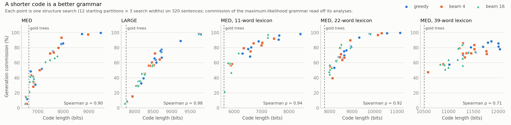

*Figure 8. Each point is one structure search; commission is that of the grammar read off its analyses. Dashed line: the code of the gold trees with gold categories.*

### What the search finds

On MED (seed 13), from sentences alone, the learner forms 12 symbols and 10 chunk types. The symbols include separate categories for nouns, determiners, adjectives, verbs and prepositions. Its code, 6,489 bits, equals that of the supervised model trained on the gold trees of the same sentences. Its brackets differ from the linguists':

```
gold      [[the woman] [liked [[the woman] [with [the park]]]]]
learned   [[[[the woman] liked] [the woman]] [with [the park]]]
```

The learned grammar chunks subject and verb first, and adjectives from the left (`[[[the big] lazy] park]`). Strict description length identifies the *language*, which the learned grammar generates as well as the gold grammar does. It leaves the binarization underdetermined. Language-level measures (compression, held-out bits, generation) are therefore the yardstick; bracket agreement with gold trees is a diagnostic.

## 9. Evaluation

**Corpora.** The paper's six conditions, each 400 sentences generated by a target grammar, with the v1 splits: 320 training sentences, 40 held-out test sentences.

| Condition | Target grammar | Nonterminals | Words |
|---|---|---|---|
| SMALL | `S → NP VP`, `VP → V NP`, `NP → Det N` | 6 | 13 |
| MED | adds adjective phrases and prepositional phrases | 11 | 22 |
| LARGE | adds relative clauses | 14 | 34 |
| TERM_LOW / MED / HIGH | MED's rules with an 11-, 22- or 39-word lexicon | 11 | 11 / 22 / 39 |

**Measures** follow Langley & Stromsten (2000):

- **Generation commission:** the share of generated sentences that the target grammar rejects (1,000 samples per model).
- **Novelty:** the share of generated sentences that are not in the training data.
- **Bracket omission and commission:** the share of gold brackets a parse misses, and the share of its brackets that are not gold.
- **Held-out bits per sentence:** −log₂ P(sentence), summed over all analyses.
- **Training code:** total, model and data bits.

## 10. Results

### Learning from analysed sentences

Five seeds, 320 training sentences. Parsing omission is 0.0% in every condition except LARGE (0.7%); v1 had 0–10%. Generation commission is 0.2% (SMALL), 0.9% (MED), 14.2% (LARGE), 0.3%, 2.4% and 2.7% (TERM_LOW/MED/HIGH), with 54–100% novelty. LARGE is the open case: relative clauses are rare, and at 320 sentences they stay merged with adjective phrases; commission falls with more data.

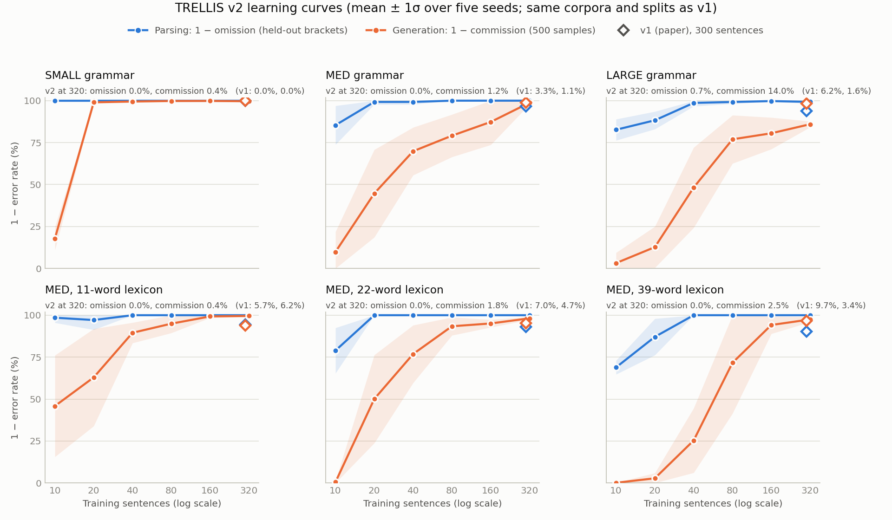

*Figure 9. Learning curves from analysed sentences (mean ± 1σ over five seeds), with v1's endpoints.*

### Learning from sentences alone

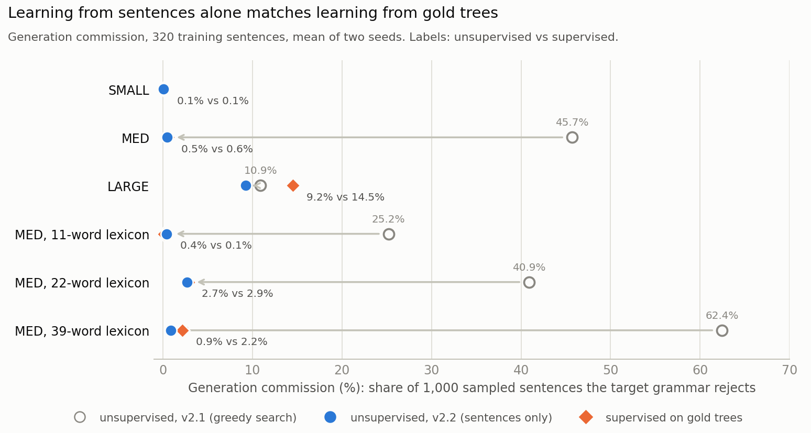

*Figure 10. Generation commission of the learner trained on sentences alone, compared with the supervised model trained on the gold trees of the same sentences. Arrows show the gain from the search described in section 8, over the greedy search of v2.1.*

| Condition | Training code, bits (alone / gold trees) | Held-out bits per sentence (alone / gold trees) | Generation commission (alone / gold trees) |
|---|---|---|---|
| SMALL | 3,251 / 3,251 | 9.5 / 9.5 | 0.1% / 0.1% |
| MED | **6,518 / 6,528** | 18.5 / 18.5 | 1.1% / 0.6% |
| LARGE | **8,031 / 8,356** | **23.6 / 24.0** | **9.2% / 14.5%** |
| TERM_LOW | 5,312 / 5,284 | 15.3 / 15.3 | 0.4% / 0.1% |
| TERM_MED | **7,677 / 7,712** | 21.8 / 21.9 | **1.7% / 2.9%** |
| TERM_HIGH | **10,458 / 10,538** | 30.7 / 30.8 | **0.8% / 2.2%** |

From sentences alone the learner matches the supervised model on every condition. Its code is within 0.6% of the gold-tree grammar's, and shorter on four conditions. Its commission is at most half a point higher, and lower on three conditions. Novelty is 91–100% (SMALL 54%: its language is small).

The two hierarchies matter here. The grammar read directly off the search's analyses still over-generates on the TERM conditions (47–56% commission at seed 13). Consolidating the same analyses into the two hierarchies, with chunk context, and re-analysing brings it to 0.1–4.3%.

### By day and by night

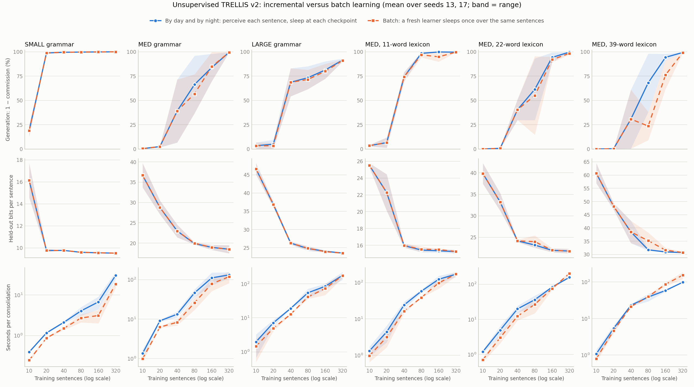

*Figure 11. The incremental learner perceives the training sentences one at a time and sleeps at 10, 20, 40, 80, 160 and 320 sentences. At each of those points a fresh batch learner sleeps once over the same sentences (mean of two seeds; band = range).*

- **Early nights mostly coincide.** Up to 40 sentences, restarting from word classes usually gives the shortest code (the stored analyses win 3 of 20 nights at 20–40 sentences), and the two learners are nearly identical.
- **Then the stored analyses pay.** From 80 sentences on they win 16 of 30 nights (SMALL excluded, where both give the same grammar). At 80 and 160 sentences the incremental learner's training code is shorter or equal in all ten condition–size cells. Its commission is lower in eight, by 16–29 points in four (for example TERM_HIGH at 80 sentences: 31.9% against 60.6%).
- **At 320 sentences** the two are equivalent (commission within 1.3 points).
- **Perception.** By 160 sentences each day's sentences are parsed almost completely (1.0–1.02 top-level chunks per sentence), at close to the held-out rate in bits.
- **Cost.** A night costs about as much as a batch sleep over the same sentences, and the six nights together 1.2–1.9 times one batch sleep at 320.

Detailed tables: [`V2_DESIGN.md`](V2_DESIGN.md), `experiments/v2/results/{main,unsupervised,incremental,search}/summary.md`.

## 11. Beyond the synthetic grammars

Nothing in the framework is specific to the paper's corpora. Three new domains test it: real English text, the structure of Chinese characters, and chess positions, where parts are joined by typed relations on a board rather than in a sequence.

### Real text: the Penn Treebank

**Setup.** NLTK's public sample of the Penn Treebank (about 3,900 Wall Street Journal sentences, `trellis2/treebank.py`). Following the standard setting for unsupervised parsing (Klein & Manning 2002), the tokens are the gold part-of-speech tags, punctuation and empty elements are removed, and sentences of 2–10 tags are kept: 542 sentences. Each seed holds out 20%. Brackets are compared without labels, ignoring single tags and the whole sentence. *Base phrases* are the lowest constituents, such as *the board* or *no asbestos*: the chunks of classic chunking.

| Model (WSJ10, mean of two seeds) | Bracket omission | Bracket commission | Base-phrase omission | Held-out bits per sentence |
|---|---|---|---|---|
| right-branching trees | 39.0% | 55.7% | 57.3% | – |
| left-branching trees | 82.9% | 87.6% | 75.0% | – |
| unigram / bigram tag models | – | – | – | 33.4 / 27.2 |
| TRELLIS v2 from tags alone | 55.3% | 67.6% | **33.1%** | 30.1 |
| TRELLIS v2 from binarized gold trees | 19.1% | 41.3% | 20.7% | 30.9 |

- **From tags alone, TRELLIS v2 finds chunks.** It recovers two thirds of the gold base phrases, against 43% for right-branching trees and 79% for the supervised model. Its chunks are noun groups (`DT NN`, `JJ JJ NN`, `NNP NNP`), verb groups (`MD VB`, `TO VB`, `VBD VBN`) and subject–verb pairs (`NN VBD`).
- **It does not find sentence structure.** On 434 sentences no larger chunk pays for itself, so analyses stay forests of about five chunks, and full-tree bracket agreement is below that of right-branching trees.
- **The grammar is a weaker sequence model than tag bigrams**, with or without supervision. Its ten or so categories over 32 tags make the strong independence assumptions of a small probabilistic grammar. The Dirichlet concentration is not the cause: the supervised grammar's training code prefers α = 0.01 to 0.001 on this data, but its held-out bits barely change.

- **More data** (training on every other sentence of up to 15 or 20 tags, about 1,100 or 1,900 sentences; the same held-out sentences) gives more categories and chunk types (34 at 1,900 sentences) and slightly shorter held-out codes (29.6 bits per sentence), but no more linguist-like full trees (bracket omission 51–52%). A night grows from two minutes to about an hour.

### A domain beyond language: Chinese characters

**Setup.** An Ideographic Description Sequence describes a character as an operator that places two or three parts, for example 湖 = ⿰ 氵 胡 (water to the left of 胡), with 胡 = ⿰ 古 月. Expanding every part down to its 270 atomic components gives each character a prefix sequence such as `⿰ 氵 ⿰ 古 月`, built from components and 12 spatial operators (`trellis2/characters.py`, CJKVI IDS data). The gold tree groups an operator with its first part, so that a component *in position* (`[⿰ 氵]`, water on the left) is a chunk. 13,297 characters of the main block have at most 11 tokens; 2,000 are learned and 500 held out. Because prefix notation with known arities is unambiguous, every generated sequence can be checked:

- *well formed*: it is a composed character, and every operator has its parts;
- *positions attested*: every component sits only in a slot (operator and position) where some real character places it;
- *real*: it is an existing character. Real characters that were held out from training have been rediscovered from learned parts and positions.

| Model (2,000 characters) | Held-out bits per character | Structure omission | Well formed | Positions attested | Rediscovered real characters | Novel and valid |
|---|---|---|---|---|---|---|
| unigram tokens | 44.1 | – | – | – | – | – |
| bigram tokens | 35.0 | – | 22% | 20% | 3.9% | 13% |
| TRELLIS v2 from IDS structures | **31.9** | **0.0%** | **96%** | 52% | 2.5% | **49%** |
| TRELLIS v2 from sequences alone | 37.2 | 28.2% | 7% | 4% | 0.7% | 3% |

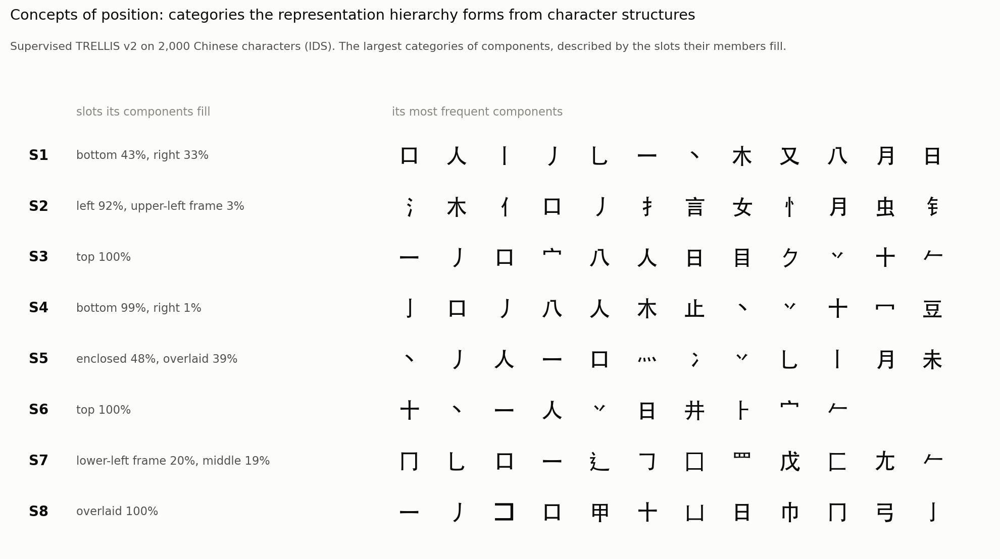

*Figure 12. The largest categories of components that the representation hierarchy forms from character structures, described by the slots their members fill in real characters. Nobody told the learner about positions: it groups components by how they behave in the analyses.*

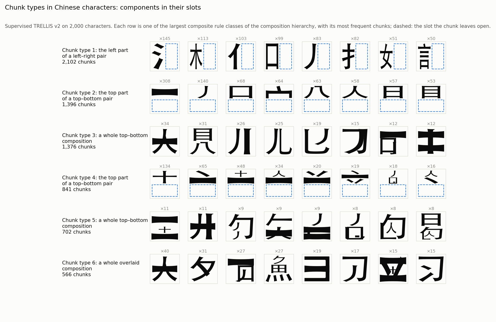

*Figure 13. The largest composite rule classes of the composition hierarchy, each with its most frequent chunks: a component in its slot, the slot it leaves open dashed (radicals on the left, components on top), and whole compositions that fill a slot of a larger character.*

- **Concepts of position emerge.** The representation hierarchy groups components by where they go: left-side radicals (氵 木 亻 扌 言 女 忄 虫 钅, 92% on the left), top components, bottom components (99% at the bottom), enclosing frames (冂 辶 匚 罒) and overlaid strokes. Chunk types include a radical in its position, such as `[⿰ 氵]` and `[⿰ 扌]`. These are the classical radical classes, found by category utility and description length alone.
- **With the structures given, the grammar compresses characters better than token bigrams** and recovers the structure of every held-out character. It generates well-formed characters 96% of the time, half of them with every component in an attested position, and it rediscovers held-out real characters (2.5% of samples).
- **Its positional errors have one source.** The largest category mixes components that go to the right and to the bottom (43% bottom, 33% right), so generation sometimes puts a bottom component on the right. Finer positional categories are the target.
- **From sequences alone the learner stalls**, as on the treebank: it describes characters less compactly than token bigrams (37.2 bits per character), and only 7% of its samples are composed, well-formed characters.

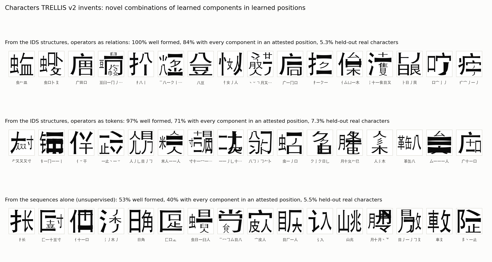

*Figure 14. Characters generated by TRELLIS v2 and drawn by composing component glyphs in the boxes their operators define: novel, well-formed characters, with each model's rates.*

### Parts joined by typed relations: chess

**Setup.** Middlegame positions from the Lichess database (January 2013, CC0): games in which both players are rated at least 1800, the position after move 15 (`trellis2/chess.py`). 4,000 positions are learned from the positions alone, and 500 are held out. A primitive is a piece; its token is its colour and kind.

- **The representation hierarchy sees a star.** A piece's context window reaches along the eight queen rays to the edge of the board (the first piece on each ray, at any distance) and to the eight squares a knight's jump away. It is written as two bags of direction-tagged values (`N:wP`, `NNE:bN`). As sixteen separate attributes it outweighed what the element is, and the categories mixed kinds of piece.
- **The composition hierarchy records a typed relation.** A chunk joins two elements whose anchors see each other along a star direction. The relation (`N1`, `E3`, `NNE`) is part of the composition, and the grammar has a relation table per rule class.
- **A board is read square by square,** as a sentence is read word by word. Each square not covered by an earlier chunk is coded as empty or as the anchor of a top-level element. Relations point forward in the scan: the N, NE, NW and E rays and the four upward knight jumps.

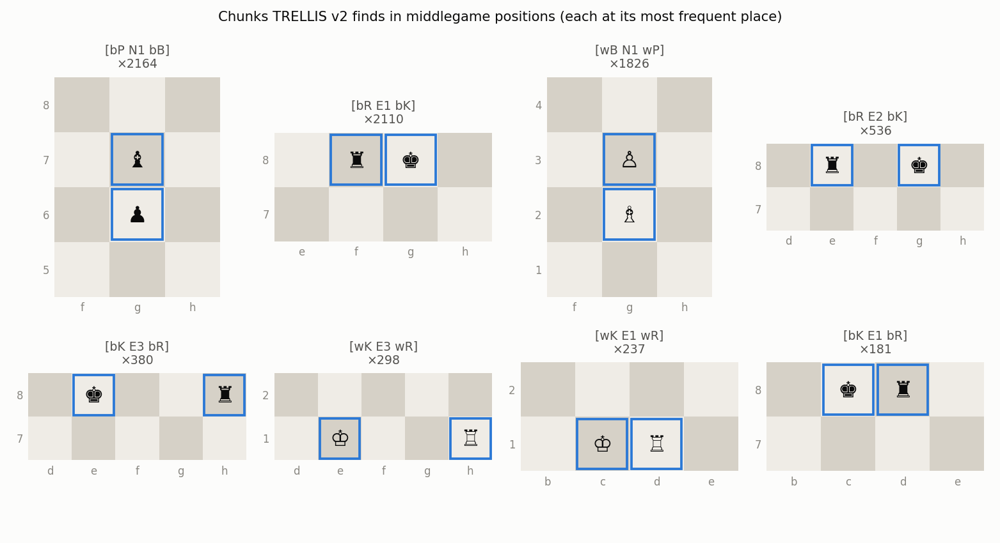

*Figure 15. The chunk types TRELLIS v2 finds in 4,000 positions, each drawn at its most frequent place: castling at every stage, on either wing, and bishops with the pawn in front of or behind them (fianchettos on g2 and g7).*

| Bits per position | Each square on its own | TRELLIS v2 |
|---|---|---|
| training (4,000) | 84.39 | 83.80 |
| held out (500) | 82.69 | 81.74 |

- **What pays is castling and fianchettos.** Where pieces stand at move 15 is most of what can be compressed. A chunk pays where pieces depend on each other beyond their squares: king and rook, and bishop and pawn. The representation hierarchy forms one category per kind of piece and one per chunk type.
- **Generated chunks are real.** 94.7% of the chunks in 1,000 generated positions occur, piece for piece and square for square, in some held-out game.
- **Generated positions are only locally right.** 35% have one king of each colour, as when each square is drawn on its own: a square-by-square code has nothing that counts kings.

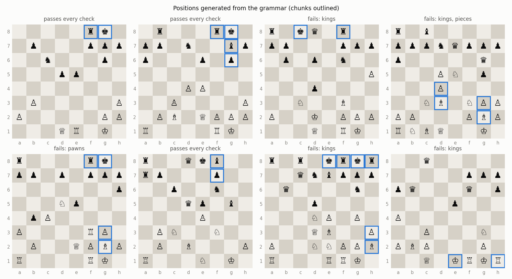

*Figure 16. Positions generated from the grammar, with their chunks outlined.*

### What the new domains show

- **Both hierarchies transfer.** The same machinery, cut by description length, works in each domain:
  - *Real text.* The representation hierarchy forms the categories of base phrases, and the composition hierarchy their chunk types (noun groups such as `DT NN`, verb groups such as `MD VB`).
  - *Characters.* The representation hierarchy forms positional classes of components, and the composition hierarchy chunk types such as `[⿰ 氵]` (Figure 13).
  - *Chess.* The star-shaped context window gives one category per kind of piece and one per chunk, and typed relations give castling and fianchetto chunks.
- **Unsupervised structure is the open problem, for two different reasons.** On the paper's corpora the search builds complete analyses. On real text and on characters it stops at forests of local chunks, and a sequence of independent chunks generates poorly. Comparing codes shows why:
  - *Real text: the objective prefers the forests.* The learner's forest grammar describes the treebank sentences in fewer bits than the grammar of their gold trees, and the gap grows with data: 8–10% at 434 sentences, 14–15% at about 1,100, 18% at about 1,900. Every gold-derived analysis costs more than the learner's own forests, whether the gold trees are binarized to the right (15,763 bits at 434 sentences, against 14,160) or to the left (16,349), or cut down to forests of gold base phrases (16,120). Right-branching trees (14,421) also cost less than gold trees.
  - *What the two hierarchies record decides what can pay* (`experiments/v2/treebank_codes.py`, every sentence of the sample).
    - **Today: phrase categories, the costliest description.** The representation hierarchy keeps a phrase apart from its head (the kind attribute), and the composition hierarchy records a chunk as an unheaded pair. Sentence structure is therefore sent through phrase categories. On the 10-tag sentences, gold trees cost 38% more than a tag bigram with the treebank's labels, and 24% more with TRELLIS's own categories.
    - **Recording heads in both hierarchies is the cheapest.** A phrase is described by its head's behaviour and its valence (whether it has taken dependents on each side, a refinement of the kind). Its make-up is head, dependent and side, as in dependency grammar.
    - **Charging total probability helps too.** Charging each sentence its total probability over all trees, which bits-back coding achieves, instead of the cost of naming one tree, brings gold structure to 5.8% above the bigram, and to within 1% after EM on the 10-tag sentences.
    - **Even then, description length cannot single out linguists' structure.** A structure with half the heads right codes slightly shorter than the one EM finds near the gold trees (72% right). Not even a tag trigram beats the bigram.
    - **Conclusion.** Tags at this scale carry too little information for sentence structure to pay. Lexical heads are the candidate, and they need words and far more text.
  - *Characters: the search falls short.* The gold structures give a shorter code than the learner's analyses (73,662 against 83,241 bits for 2,000 characters, 11.5% shorter), even in the plain code the search minimizes (71,703 against 79,740), so better structures exist and the search does not reach them. A wider beam barely helps (79,207 bits with 16 instead of 4). Starting categories do: from the supervised model's 26 token categories, which the representation hierarchy formed with chunk context and which therefore see each component's slot, the same search builds nearly complete analyses (1.4 chunks per character instead of 4.3). Bigram word classes cannot see which slot a component fills, as they could not tell verbs from prepositions on MED. Two ways of giving the search better starting categories were tried, and neither helps:
    - *restarting from the categories the representation hierarchy assigns after a night* (worse: 83,244 against 79,740 bits). The hierarchy sees a component's slot only through operator-plus-part chunks, and the night's analyses hold too few of them;
    - *starting from finer partitions*, down to raw tokens (worse at every level).

    Even the supervised model's categories leave the search 10% above the gold structures, so this is mostly a search problem; split moves are the next attempt.
- **A tried and dropped move.** Attaching a pair directly to an existing category (a chunk move followed by a merge, in one step) took cheap early attachments and ended in much longer codes on MED and LARGE.

## 12. Relation to TRELLIS v1 and the paper's postulates

| | TRELLIS v1 (the paper) | TRELLIS v2 |
|---|---|---|
| Stored descriptions | content and context of each chunk | representation (behaviour) and composition (make-up) of every element |
| Hierarchies | concept and chunk trees | two Cobweb hierarchies, each with primitives and composites |
| Categories | concepts above a recognition threshold | a cut chosen by description length, plus model merging |
| Parsing | greedy, gated chunk recognition | inside-outside posteriors, minimum-risk tree |
| Generation | chunk replay | sampling from the same normalized grammar |
| Learning | from gold analyses | from analyses, or from sentences alone, by day and by night |
| Decisions | thresholds and gates | description length |

The postulates carry over as follows:

- **R1–R3** (elements, primitives and composites) are unchanged.
- **R4–R6:** an element's two descriptions are now representation and composition.
- **O1–O5:** two taxonomies, each holding primitives and composites, and the grammar is a cut through each.
- **P5–P7:** the recognition threshold is replaced by the chunk's posterior and minimum-risk decoding.
- **P8–P10:** generation samples from the same grammar.
- **Learning:** Cobweb's incremental operators are unchanged. Consolidation re-describes experiences with current concepts and replays them, and description length picks the level of generalization.

## 13. Using the code

| Module (`src/trellis2/`) | Contents |
|---|---|
| `cobweb.py` | Cobweb (category utility, the four operators, weighted and bag-valued attributes, stable leaves): the compiled `cobweb_cu` of cobweb-private; the pure-Python reference is `tests/trellis2/reference_cobweb.py` |
| `memory.py` | element records, representation instances (surface context + chunk context), the representation hierarchy by replay |
| `grammar.py` | cuts, their search, model merging, the composition hierarchy, the factored grammar (with typed relations when a domain has them) and its code |
| `chart.py` | inside-outside with forests, posteriors, minimum-risk and Viterbi decoding, sampling |
| `model.py` | `Trellis2`: learn from analysed sentences, consolidate, parse, generate (a domain may bring its own memory) |
| `mdl.py` | Elias codes, Dirichlet-multinomial rows, the model/data split |
| `mdl_search.py` | symbolic analyses, word classes, the exact-scored beam search |
| `unsupervised.py` | `UnsupervisedLearner`: learning by day and by night |
| `evaluation.py` | target-grammar recognizer, bracket tallies |
| `data.py` | trees, corpora, the v1 splits, the six conditions |
| `treebank.py` | Penn Treebank sentences (WSJ10, gold tags): cleaning, gold and base-phrase brackets |
| `characters.py` | Chinese characters from IDS: prefix sequences, gold trees, checks for generated characters |
| `stories.py` | simple English from TinyStories: sentences over a small vocabulary |
| `chess.py` | chess positions: the star context, typed relations, the square-by-square code, the relational search, learning and sampling positions |

Learning from analysed sentences:

```python
from math import log
from trellis2 import Trellis2, load_corpus, v1_split

train, test = v1_split(load_corpus("../trellis_v1/data/cfg_grammar_experiment_med"), seed=13)
model = Trellis2(seed=13)
for ex in train:
    model.learn(ex.tokens, ex.tree)          # record every element
grammar = model.consolidate()                # hierarchies, cuts, grammar
tree = model.parse(test[0].tokens)           # minimum-risk tree
samples, _ = model.generate(10)              # [(tokens, tree), ...]
bits = -model.log_prob(test[0].tokens) / log(2)
```

Learning from sentences alone:

```python
from trellis2.unsupervised import UnsupervisedLearner

learner = UnsupervisedLearner(seed=13)
for i, ex in enumerate(train):
    learner.observe(ex.tokens)               # day: perceive with the current grammar, store
    if i + 1 in (10, 20, 40, 80, 160, 320):
        learner.sleep()                      # night: search, consolidate, re-analyse
print(learner.parse(test[0].tokens).to_string(test[0].tokens))
```

The hierarchies run on the compiled `cobweb_cu` of cobweb-private (branch `karthik-experimental`). Install cobweb-private, or build the target and put its build directory on the Python path:

```
cd cobweb-private && cmake -S . -B build && cmake --build build --target cobweb_cu
```

Reproducing everything (times on a 12-core laptop):

```
python -m pytest tests/trellis2 -q                                          # 33 tests, seconds
python experiments/v2/run_synthetic.py --out experiments/v2/results/main    # supervised curves, ~6 min
python experiments/v2/plot_learning_curves.py experiments/v2/results/main
python experiments/v2/run_unsupervised.py --seeds 13,17                     # ~10 min
python experiments/v2/run_incremental.py --seeds 13,17                      # ~1 h
python experiments/v2/plot_incremental.py experiments/v2/results/incremental
python experiments/v2/run_search_study.py                                   # ~2 min
python experiments/v2/run_treebank.py --train-max-len 10 --out experiments/v2/results/treebank/wsj10
python experiments/v2/treebank_codes.py --em --trellis --out experiments/v2/results/treebank/structure_codes.md
python experiments/v2/run_characters.py                                     # ~1 h
python experiments/v2/run_stories.py --train 5000                           # simple English
python experiments/v2/run_chess.py --train 4000                             # chess (after --extract)
python docs/figures/make_figures.py                                         # this document's figures, ~12 min
```

The paper's corpora are read from `../trellis_v1/data` (the v1 snapshot), with `data/` as the fallback. The treebank sample and the IDS database are downloaded into `data/` (see the docstrings of `treebank.py` and `characters.py`); they are not committed.

## 14. Limitations and next steps

- **Sentence-level structure without supervision.** On the paper's corpora the search builds complete analyses. On characters it stops at forests of local chunks although the gold structures code shorter: a search problem, from categories that cannot see a component's slot. On real-text tags it stops at forests because no description we know makes sentence structure pay at this scale ([section 11](#what-the-new-domains-show)).
- **A weak sequence model on real data.** With about ten categories, the grammar makes the strong independence assumptions of a small probabilistic grammar, and tag bigrams describe real text more compactly.
- **Typed relations on a board, operator tokens in characters.** Chess composes parts by typed relations, but characters still write their spatial operators as tokens, so for them the relation is learned as context. A board's square-by-square code also has nothing that counts pieces, so generated positions may have two kings.
- **Scale.** Each night runs three full consolidations. With the compiled Cobweb a night on 320 synthetic sentences takes 6–85 seconds (about half the time before it); before it, a night took about an hour for 1,900 treebank sentences or 2,000 characters. The search, the grammar read-out and the charts are still Python.
- **Nights repeat the batch search.** The search can only merge categories, so every night may start over from word classes. Split moves (refining a category together with the chunk categories built on it) would let nights continue from the stored analyses.
- **Linguists' trees.** Description length identifies the language, not its conventional binarization; bracket agreement with gold trees is moderate.

Next: for characters, starting categories read off the representation hierarchy, or split moves along it, and finer positional concepts; for real text with words at scale, heads recorded in both hierarchies and the total-probability code; the Dirichlet concentration chosen by description length; typed relations between parts in the composition hierarchy; then chess.

## 15. Glossary

- **Element:** a node of an analysis, either a *primitive* (a token) or a *composite* (two parts).
- **Chunk:** a composite element, or the composite rule class it instantiates.
- **Concept:** a node of a Cobweb hierarchy: a probabilistic summary of the instances below it.
- **Cut:** a set of concepts that partitions the elements; the grammar's categories come from cuts.
- **Symbol:** a category of the grammar, formed from the representation cut and model merging.
- **Rule class:** a cell of the composition cut: a way of realizing symbols (a token, or a pair of symbols). Composite rule classes are the chunk types.
- **Consolidation:** re-describing the stored elements with current categories, replaying them into the hierarchies and reading off the grammar.
- **Description length:** the bits needed to transmit the data with the grammar, including the grammar's own cost; model bits + data bits.
- **Perception:** the Viterbi (shortest-code) analysis of a new experience under the current grammar.
- **Omission / commission:** the share of correct items a learner misses, and the share of its outputs that are wrong.

## 16. References

- Baker, J. K. (1979). Trainable grammars for speech recognition. *Speech Communication Papers, 97th Meeting of the Acoustical Society of America.*
- Brown, P. F., deSouza, P. V., Mercer, R. L., Della Pietra, V. J., & Lai, J. C. (1992). Class-based n-gram models of natural language. *Computational Linguistics, 18*(4).
- Elias, P. (1975). Universal codeword sets and representations of the integers. *IEEE Transactions on Information Theory, 21*(2).
- Fisher, D. H. (1987). Knowledge acquisition via incremental conceptual clustering. *Machine Learning, 2*(2).
- Goodman, J. (1996). Parsing algorithms and metrics. *Proceedings of ACL.*
- Grünwald, P. D. (2007). *The Minimum Description Length Principle.* MIT Press.
- Langley, P., & Stromsten, S. (2000). Learning context-free grammars with a simplicity bias. *Proceedings of ECML.*
- Lari, K., & Young, S. J. (1990). The estimation of stochastic context-free grammars using the inside-outside algorithm. *Computer Speech and Language, 4*(1).
- McClelland, J. L., McNaughton, B. L., & O'Reilly, R. C. (1995). Why there are complementary learning systems in the hippocampus and neocortex. *Psychological Review, 102*(3).
- Rissanen, J. (1978). Modeling by shortest data description. *Automatica, 14*(5).
- Stolcke, A., & Omohundro, S. (1994). Inducing probabilistic grammars by Bayesian model merging. *Proceedings of ICGI.*
- Wolff, J. G. (1982). Language acquisition, data compression and generalization. *Language & Communication, 2*(1).
